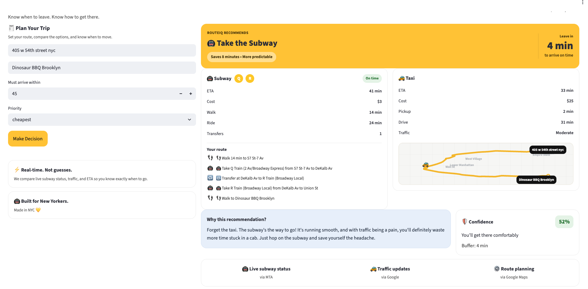

# 🚕 RouteIQ-NYC
# 🚇🚕 Take the right route — and know exactly when to leave.

RouteIQ is a real-time NYC decision engine that chooses between subway and taxi using live data, structured logic, and AI reasoning.

Built with Python, Streamlit, Google Maps APIs, OpenAI, and live MTA data — deployed on Render.

Now featuring a fully redesigned mobile-first interface with real MTA-style route visualization, confidence scoring, and live route rendering.

---

# 🚀 Live App
👉 https://routeiq-nyc.onrender.com/

---

# 📸 Preview



RouteIQ now includes:

- 📱 Mobile-first NYC transit UI
- 🚇 Real MTA-style subway cards
- 🚕 Live taxi route visualization
- 🧠 AI-powered transit decision engine
- 🛡 Confidence + leave timing system
- 🗺 Visual route intelligence

---

# 🧠 What It Does

RouteIQ helps users decide how to get somewhere in NYC — and when to leave.

It compares subway vs taxi using real routing data, then:

- 🚇 Calculates subway travel time (including multi-train routes + transfers)
- 🚕 Calculates taxi ETA using live routing data
- 🗺 Renders real route paths using map visualization
- 🚦 Integrates live MTA service status (delays, disruptions)
- 🧠 Applies a decision engine based on user priorities
- 💬 Explains the decision using AI in a NYC-style voice
- ⏱ Shows confidence and leave timing
- 🪧 Visually displays subway routes using real MTA-style signage
- 📱 Delivers a fully mobile-first NYC transit experience
- 🧩 Uses modular reusable UI components
- 🛡 Calculates decision confidence and arrival risk

RouteIQ now handles:

- multi-leg subway routes
- transfer logic
- real-time delay awareness
- visual route mapping
- live decision confidence scoring

---

# ⚡ Why This Is Different

Most navigation apps tell you how to get somewhere.

RouteIQ tells you:

👉 What decision to make (subway vs taxi)  
👉 Why it’s the right choice (AI reasoning layer)  
👉 When to leave (real-time timing intelligence)

Instead of just routing, RouteIQ acts as a decision engine — combining live data, structured logic, and AI to guide real-world actions.

This project demonstrates:

- building systems, not just interfaces
- combining deterministic logic with LLM reasoning
- designing AI that supports decisions instead of replacing them
- building mobile-first AI products with real-world utility

---

# 🧠 System Overview

RouteIQ combines deterministic logic + real-time data + AI reasoning.

---

## 1. Data Layer

- Google Geocoding API → convert addresses into coordinates
- Google Routes API → fetch real-time ETAs for driving and transit
- MTA Service Status API → live subway delays and alerts

---

## 2. Decision Engine

Evaluates:

- time
- cost
- priority (fastest, cheapest, balanced)
- service reliability (MTA status integration)
- arrival confidence
- timing risk

Produces:

- recommendation
- arrival buffer
- confidence level
- leave timing

---

## 3. AI Reasoning Layer

OpenAI API → turns structured trip decisions into natural-language explanations

Adapts to:

- weather
- traffic
- subway delays
- edge cases

Uses a consistent NYC-style voice.

---

# ✨ Features

## 🚇 Subway vs Taxi Comparison

- ETA comparison using live routing data
- Cost comparison
- Walk / ride / transfer breakdown
- Supports multi-train routes with transfers

---

## 📱 Mobile-First UI Redesign (NEW)

RouteIQ was fully redesigned into a mobile-first transit decision engine.

The interface now includes:

- large recommendation hero cards
- improved visual hierarchy
- cleaner spacing + typography
- responsive mobile layouts
- reusable component-based rendering
- faster glanceable decision UI

Optimized for:

- commuters on the move
- one-handed usage
- quick transit decisions
- real-world NYC travel behavior

This upgrade transformed RouteIQ from a prototype dashboard into a product-style experience.

---

## 🗺 Route Map Visualization (UPGRADED)

- Displays live route paths directly in the UI
- Uses real Google polyline route data
- Shows spatial flow of trips (not just numbers)
- Adds contextual NYC route visualization
- Renders taxi route flow visually inside the app
- Enhances decision clarity and realism

This transforms RouteIQ from an ETA calculator into visual decision intelligence.

---

## 🚦 Live MTA Status Integration (NEW)

- Pulls real-time subway service status
- Detects:
  - delays
  - service changes
  - disruptions

Feeds directly into:

- decision engine
- confidence scoring
- AI explanation layer

---

## 📱 Smart Link Previews (NEW)

Custom iMessage / social link previews

When shared, RouteIQ displays a clean, product-style preview card instead of a raw URL.

👉 https://routeiq-landing.onrender.com

---

## 🪧 MTA-Style Route Visualization (UPGRADED)

Displays subway routes using realistic NYC-style transit cards.

Features include:

- real train colors
- circular MTA-style train bullets
- destination rendering
- multi-line transfer stacking
- dark-card subway visuals
- mobile-optimized spacing + typography

Supports:

- E → C transfers
- multi-leg subway routing
- clean vertical route visualization

This makes RouteIQ feel closer to a real transit product instead of raw route text.

---

## 🧠 Decision Engine

- Weighted scoring system
- Priority-based outcomes:
  - fastest
  - cheapest
  - balanced

Incorporates:

- live transit reliability
- delay severity
- timing risk
- arrival confidence

---

## 🛡 Confidence + Leave Timing

- Calculates arrival buffer
- Converts that into:
  - “You’ll get there comfortably”
  - “It’s a close call”
  - “Risky — you might be late”

Shows:

- Leave in X minutes
- confidence percentage
- arrival safety buffer

---

## 💬 AI Explanation Layer

- Explains why the decision is correct
- Context-aware based on:
  - weather
  - traffic
  - subway delays
  - route reliability

Uses a conversational NYC-style voice.

---

## 🌧 Weather Awareness

- Adjusts reasoning based on conditions like rain
- Impacts comfort and recommendation logic

---

## 🧩 Component Architecture Upgrade (NEW)

RouteIQ was refactored into reusable UI modules.

New structure:

/components

- cards.py → subway route visuals
- hero.py → recommendation hero cards
- confidence.py → confidence scoring utilities

Benefits:

- cleaner architecture
- reusable UI systems
- easier scaling
- production-style frontend organization

---

# 🆕 Live Data Upgrade

RouteIQ now operates as a true real-time decision system:

- 📍 Input real addresses
- 🗺 Convert them to coordinates
- 🚗 Pull live driving ETA
- 🚇 Pull live transit ETA
- 🚦 Incorporate live MTA service conditions
- 🗺 Render actual route paths
- 🛡 Calculate arrival confidence

This moves the project from:

simulation → real-world decision intelligence

---

# ⚠️ Current Limitations

Some breakdown fields are still estimated or simplified:

- wait time
- exact transfer timing
- detailed ride segmentation
- traffic level labeling
- taxi pickup time

Transit routing depends on Google Routes API and may occasionally:

- favor longer walks over transfers
- miss optimal multi-line combinations

---

# 🔜 Next Up

- 📍 Show transfer stations explicitly
  - e.g., “Transfer at 42 St–Port Authority”

- 🚗 Improve traffic classification

- 🌦 Expand weather integration

- 🚕 Add Uber/Lyft pricing + pickup estimates

- 🧠 Enhance decision intelligence
  - risk tolerance
  - predictive commute timing
  - reliability weighting

- 🗺 Improve map rendering
  - subway vs taxi overlays
  - multi-route comparison
  - animated route flow

- 📱 Product evolution
  - installable web app (PWA)
  - push notifications
  - leave-now alerts
  - shareable trip cards

---

# 🛠 Tech Stack

## Backend
- Python
- Streamlit
- OpenAI API
- Google Maps APIs (Geocoding + Routes)
- MTA Service Status API

## Frontend / UI
- Mobile-first Streamlit interface
- Custom HTML/CSS rendering
- Modular UI component architecture
- Responsive transit card layouts

## Infrastructure
- Render
- Git + GitHub

---

# 🚀 Deployment

Fully deployed on Render:

👉 https://routeiq-nyc.onrender.com/

Includes:

- environment variable management
- GitHub auto-deploy
- production debugging + fixes
- live cloud deployment pipeline

---

# 🛠️ Run Locally

```bash
export OPENAI_API_KEY=your_key_here
export GOOGLE_MAPS_API_KEY=your_key_here

git clone https://github.com/dane-anderson/routeiq-nyc.git
cd routeiq-nyc
pip install -r requirements.txt
streamlit run app.py
